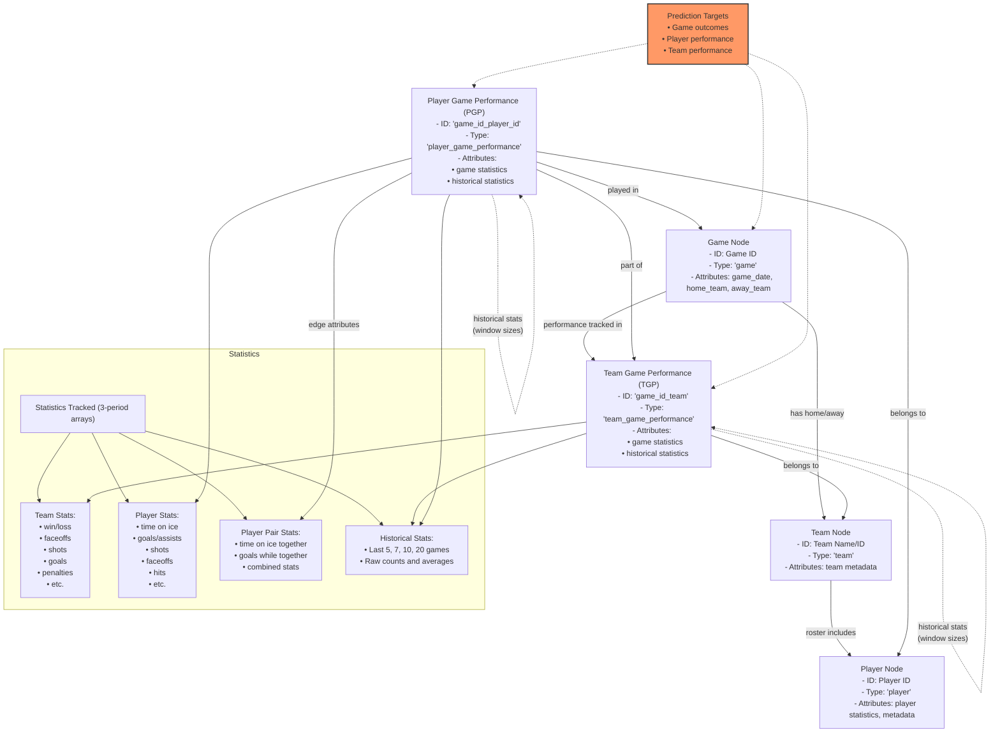

# Hockey Game Prediction Model Using Graph Neural Networks

## Overview

This project implements a Graph Neural Network (GNN) model for predicting hockey game outcomes and player performance. By representing hockey games, teams, and players as a complex network, the model captures both individual statistics and the crucial interactions between players that impact game results.

## Graph Data Structure

The core of this project is a specially designed graph structure that models the hockey domain:



### Key Components

#### Node Types
- **Game Nodes**: Represent individual hockey games with metadata
- **Team Nodes**: Represent hockey teams
- **Player Nodes**: Represent individual players and their career statistics
- **Team Game Performance (TGP)**: Track team statistics for specific games
- **Player Game Performance (PGP)**: Track player statistics for specific games

#### Edge Types
- Team-Game edges: Connect teams to games they participated in
- Player-Game edges: Connect players to their game performances
- Player-Player edges: Model on-ice chemistry between players
- Historical connections: Link performances across time for temporal analysis

#### Statistical Features
- All statistics are tracked across three periods (regulation, overtime, shootout)
- Each node contains raw statistical counts and derived metrics
- Historical windows (5, 7, 10, 20 games) capture performance trends

## Data Processing Pipeline

The data processing pipeline is designed to collect, process, and curate hockey data efficiently, with a focus on incremental updates to minimize redundant processing and API calls.

### 1. Data Collection

The system retrieves data from the NHL API through an incremental and optimized pipeline:

#### API Collection Process

The collection process consists of several coordinated modules:

- **Season Data Collection** (`get_season_data`): Retrieves basic season information, using cached data when available.
- **Team Data Collection** (`get_team_list`): Fetches team information with support for selective updates.
- **Game Data Collection** (`get_game_list`): Constructs a comprehensive game schedule database by iterating through teams and seasons.
- **Boxscore Collection** (`get_boxscore_list`): Fetches detailed game statistics, with smart detection of new games requiring data.
- **Play-by-Play Collection** (`get_playbyplay_data`): Retrieves detailed event data including shifts, plays, and game rosters.
- **Player Name Collection** (`get_player_names`): Builds a player information database, focusing on updating only new players.

#### Incremental Data Collection Features

The system employs several strategies to optimize the data collection process:

- **Selective Reloading**: Configuration flags (`reload_seasons`, `reload_teams`, etc.) control whether to reload specific data types or use cached versions.
- **Differential Updates**: Rather than reprocessing all data, the system identifies only new or missing data that needs to be collected.
- **Cache Management**: Processed data is saved to disk using pickle files, enabling quick loading in future runs.
- **Parallel Processing**: Data fetching leverages multi-processing and multi-threading to accelerate collection:
  - `ThreadPoolExecutor` for I/O-bound tasks (API requests)
  - `ProcessPoolExecutor` for CPU-bound tasks (data processing)
- **Fault Tolerance**: Includes error handling to recover from API failures and continue processing.
- **Progress Tracking**: The system reports progress during long-running operations to provide visibility.

For example, when collecting game data, the system:
1. Checks for existing cached game data
2. Identifies games that need updates (e.g., games that were scheduled but now have been played)
3. Creates a list of team-season pairs that need updating
4. Fetches only the required data using parallel requests
5. Merges new data with existing cached data
6. Saves the updated dataset

This approach substantially reduces processing time and network load compared to re-fetching all data for each run.

### 2. Graph Construction

Once the raw data is collected, it's transformed into the graph structure:

- **Teams and players** are added as nodes
- **Games are processed chronologically** to ensure proper historical window calculations
- **Player game performances** are linked to appropriate teams and games
- **Temporal edges** are created to connect performances across time

### 3. Shift Processing

On-ice player combinations and events are processed to capture player chemistry:

- **Player Pairings**: The system tracks which players are on ice together
- **Event Attribution**: Events (goals, shots, etc.) are attributed to players and their interactions
- **Temporal Patterns**: Shifting lineups and their impact on game events are analyzed

### 4. Data Curation

The curation process (`curate_data`) transforms raw NHL API data into structured datasets optimized for modeling:

- Processes game events and shifts to extract detailed statistics
- Validates statistics against official totals
- Computes player-interaction metrics
- Structures data by game period (regulation, overtime, shootout)
- Uses parallel processing to handle large datasets efficiently
- Supports incremental updates to avoid reprocessing previously curated games

### 5. Historical Statistics Calculation

Pre-calculated statistics over various time windows capture team and player trends:

- **Multiple Window Sizes**: Statistics are calculated over 5, 7, 10, and 20 game windows
- **Rolling Updates**: Historical windows are efficiently updated as new games are added
- **Feature Engineering**: Derived metrics focus on predictive signals for game outcomes

### 6. Index Building

The final step builds efficient lookup structures for quick graph traversal:
- Hash tables for node/edge retrieval
- Player/team cross-references
- Chronological indices for temporal queries

## Model Features

The graph structure is specially designed to capture:

- **Individual Performance**: Player statistics in isolation
- **Team Dynamics**: How teams perform collectively
- **Player Chemistry**: How players perform together through edge attributes
- **Temporal Patterns**: Historical trends through time-windowed statistics
- **Game Context**: Home/away status, days since last game, etc.

## Usage

To use this model:

1. Set up the configuration with appropriate file paths and parameters:
   ```python
   config = Config({
       'verbose': True,
       'produce_csv': True,
       'season_count': 1,
       'delete_files': False,
       'reload_seasons': False,
       'reload_teams': False,
       'reload_games': False,
       'update_game_statuses': True,
       'reload_boxscores': False,
       'reload_players': False,
       'reload_playernames': False,
       'reload_playbyplay': False,
       'reload_rosters': False,
       'reload_curate': False,
       # other configuration options
   })
   ```

2. Collect and process the data:
   ```python
   from src_code.collect.collect_01 import (get_season_data, get_team_list, get_game_list, 
                                            get_boxscore_list, get_playbyplay_data, get_player_names)
   
   # Collect all data or use cached data based on config settings
   get_season_data(config)
   get_team_list(config)
   get_game_list(config)
   get_boxscore_list(config)
   get_player_names(config)
   get_playbyplay_data(config)
   ```

3. Curate the data for model input:
   ```python
   from src_code.curate.curate_01 import curate_data
   curate_data(config)
   ```

4. Build the graph and train the model:
   ```python
   from src_code.model.model_01 import model_data
   model_data(config)
   ```

5. Visualize the graph (optional):
   ```python
   from src_code.model.model_01 import model_visualization
   model_visualization(config)
   ```

6. Run the GNN training and prediction pipeline:
   ```python
   from src_code.model.model_03 import run_gnn_enhanced
   run_gnn_enhanced(config, config_model)
   ```

## Requirements

- Python 3.8+
- NetworkX
- PyTorch
- PyTorch Geometric
- NumPy
- Pandas
- Matplotlib
- Requests
- BeautifulSoup
- Multiprocessing
- Concurrent.futures

## Project Structure

```
/
├── config/
│   ├── config.py
│   ├── config_model.py
│   ├── playbyplay.py
│   ├── season.py
│   ├── team.py
│   ├── game.py
│   └── player.py
├── src_code/
│   ├── collect/
│   │   └── collect_01.py
│   ├── curate/
│   │   └── curate_01.py
│   ├── model/
│   │   ├── model_01.py
│   │   ├── model_02.py
│   │   └── model_03.py
│   └── utils/
│       ├── utils.py
│       ├── graph_utils.py
│       ├── display_graph_utils.py
│       └── save_graph_utils.py
├── storage/
│   ├── pickles/
│   ├── analysis/
│   │   └── gnn_analysis/
│   ├── output/
│   │   ├── csv/
│   │   ├── pkl/
│   │   ├── jpg/
│   │   ├── excel/
│   │   └── graph/
└── main.py
```

## Future Work

- Implement and train various GNN architectures (GCN, GAT, GraphSAGE)
- Experiment with different prediction targets (game outcomes, player stats)
- Add real-time prediction capabilities for in-game decision support
- Explore transfer learning between seasons
- Add more advanced player interaction features
- Improve incremental data collection with webhooks for real-time updates
- Implement automated model retraining based on prediction performance
- Develop visualization tools for model interpretability

## Contributing

Contributions are welcome! Please feel free to submit a Pull Request.

## License

This project is licensed under the MIT License - see the LICENSE file for details.