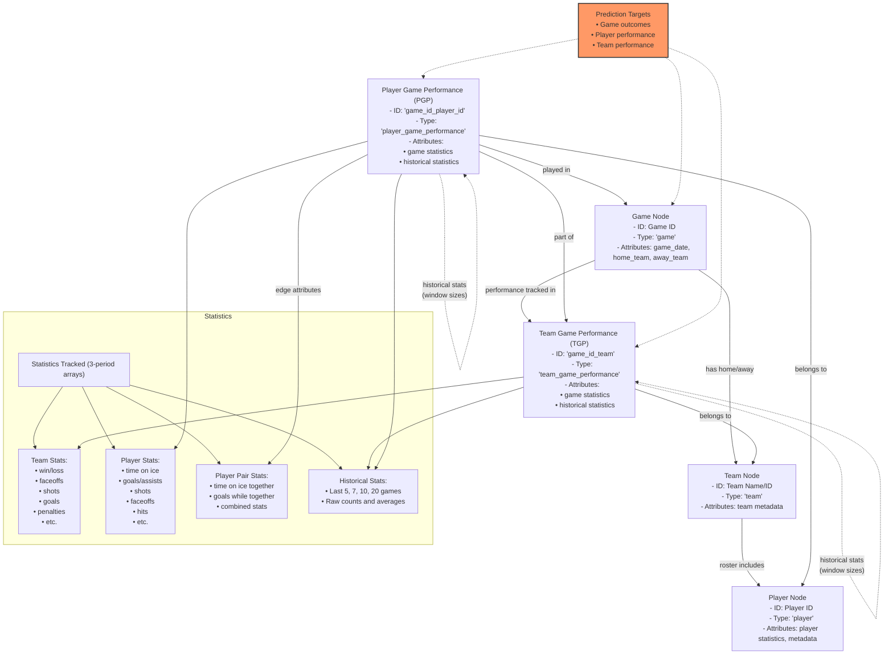

# Hockey Game Prediction Model Using Graph Neural Networks

## Overview

This project implements a Graph Neural Network (GNN) model for predicting hockey game outcomes and player performance. By representing hockey games, teams, and players as a complex network, the model captures both individual statistics and the crucial interactions between players that impact game results.

## Graph Data Structure

The core of this project is a specially designed graph structure that models the hockey domain:



### Key Components

#### Node Types
- **Game Nodes**: Represent individual hockey games with metadata
- **Team Nodes**: Represent hockey teams
- **Player Nodes**: Represent individual players and their career statistics
- **Team Game Performance (TGP)**: Track team statistics for specific games
- **Player Game Performance (PGP)**: Track player statistics for specific games

#### Edge Types
- Team-Game edges: Connect teams to games they participated in
- Player-Game edges: Connect players to their game performances
- Player-Player edges: Model on-ice chemistry between players
- Historical connections: Link performances across time for temporal analysis

#### Statistical Features
- All statistics are tracked across three periods (regulation, overtime, shootout)
- Each node contains raw statistical counts and derived metrics
- Historical windows (5, 7, 10, 20 games) capture performance trends

## Data Processing Pipeline

1. **Data Collection**: NHL API data is fetched and structured
2. **Graph Construction**: 
   - Teams and players added as nodes
   - Games processed chronologically
   - Player game performances linked to appropriate teams and games
3. **Shift Processing**: On-ice player combinations and events processed
4. **Historical Statistics**: Pre-calculate statistics over various time windows
5. **Index Building**: Build efficient lookup structures for quick graph traversal

## Model Features

The graph structure is specially designed to capture:

- **Individual Performance**: Player statistics in isolation
- **Team Dynamics**: How teams perform collectively
- **Player Chemistry**: How players perform together through edge attributes
- **Temporal Patterns**: Historical trends through time-windowed statistics
- **Game Context**: Home/away status, days since last game, etc.

## Usage

To use this model:

1. Set up the configuration with appropriate file paths and parameters:
   ```python
   config = Config({
       'verbose': True,
       'produce_csv': True,
       # other configuration options
   })
   ```

2. Process the data and build the graph:
   ```python
   from src_code.model import model_data
   model_data(config)
   ```

3. Visualize the graph (optional):
   ```python
   from src_code.model import model_visualization
   model_visualization(config)
   ```

4. Run the GNN training and prediction pipeline:
   ```python
   # Implementation of GNN model to be added
   ```

## Requirements

- Python 3.8+
- NetworkX
- PyTorch
- PyTorch Geometric
- NumPy
- Pandas
- Matplotlib
- Requests

## Project Structure

```
/
├── config/
│   ├── playbyplay.py
│   ├── season.py
│   ├── team.py
│   ├── game.py
│   └── player.py
├── src_code/
│   ├── model.py
│   └── utils/
│       ├── utils.py
│       ├── graph_utils.py
│       ├── display_graph_utils.py
│       └── save_graph_utils.py
├── storage/
│   ├── pickles/
│   ├── output/
│   │   ├── csv/
│   │   ├── pkl/
│   │   ├── jpg/
│   │   ├── excel/
│   │   └── graph/
└── main.py
```

## Future Work

- Implement and train various GNN architectures (GCN, GAT, GraphSAGE)
- Experiment with different prediction targets (game outcomes, player stats)
- Add real-time prediction capabilities for in-game decision support
- Explore transfer learning between seasons
- Add more advanced player interaction features

## Contributing

Contributions are welcome! Please feel free to submit a Pull Request.

## License

This project is licensed under the MIT License - see the LICENSE file for details.